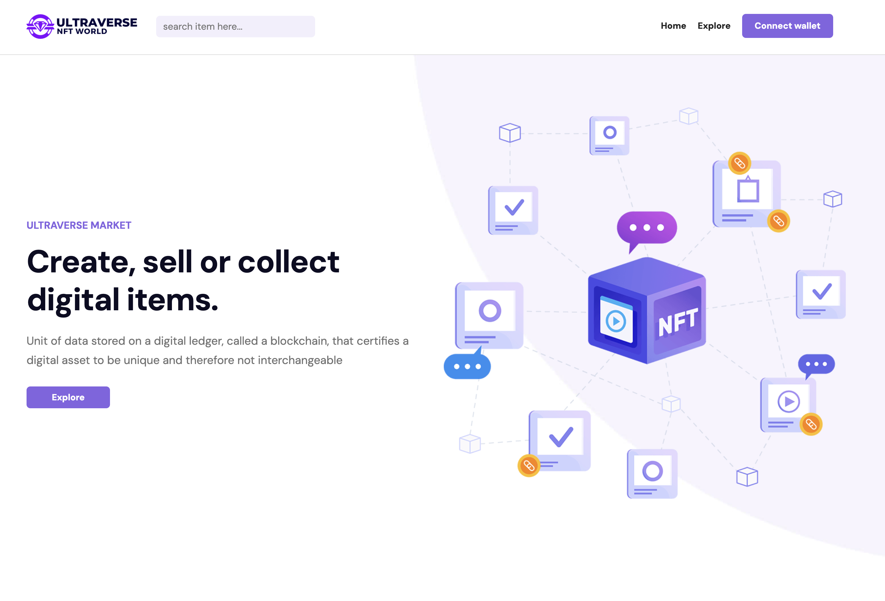

# Ultraverse NFT World

[](https://github.com/markwaldron7string/ultraverse/actions/workflows/ci.yml)
[](https://github.com/markwaldron7string/ultraverse/actions/workflows/cd.yml)

[](https://react.dev)
[](https://jestjs.io)
[](YOUR_LIVE_URL)

Ultraverse NFT World is a React marketplace UI for browsing NFT collections, featured items, authors, and item details. It includes a polished landing page, responsive navigation, carousel sections, and placeholder wallet-connection behavior ready for a future integration.



## Features

- Marketplace landing page with Ultraverse branding and NFT-focused hero content.
- Explore, author, and item-detail routes powered by React Router.
- Responsive navigation with desktop and mobile menu states.
- Carousel-driven collection and item sections.
- Jest and React Testing Library smoke coverage for the app shell.

## Tech Stack

- React 17
- Create React App / React Scripts
- React Router 6
- Jest and React Testing Library
- AOS animations
- Owl Carousel and Slick Carousel assets

## Getting Started

Install dependencies:

```sh
pnpm install
```

Start the local development server:

```sh
pnpm start
```

Run the Jest test suite:

```sh
pnpm test --watchAll=false
```

Create a production build:

```sh
pnpm build
```

## CI/CD Validation

The `mark-merge` branch has passing CI/CD validation. The CI workflow installs dependencies with `pnpm install --frozen-lockfile`, runs the Jest suite, and creates a production build. The CD workflow builds the deployable artifact, serves the generated `build/` directory, smoke-tests the HTML and static assets over HTTP, and uploads the build artifact.
